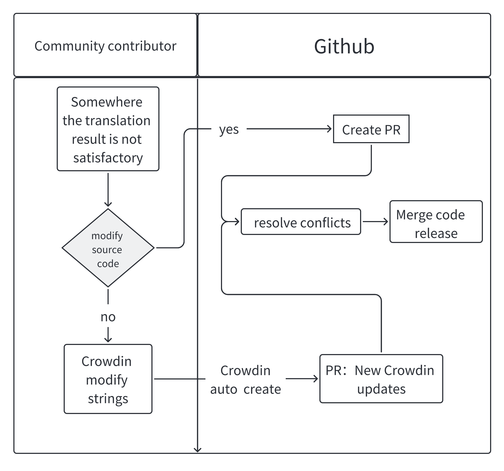

# دليل المطور

هذا الدليل يساعدك على البدء في تطوير APITable.

## التبعيات

تأكد من أن لديك التبعيات التالية ولغات البرمجة مثبتة قبل إعداد بيئة المطور الخاص بك:

- `git`
- [docker](https://docs.docker.com/engine/install/)
- [docker-compose v2](https://docs.docker.com/engine/install/)
- `make`


### لغة البرمجة

إذا كنت تستخدم macOS أو Linux. نوصي بتثبيت لغة البرمجة مع مدير SDK `sdkman` و `nvm`.

```bash
# التثبيت السريع nvm
curl -o- https://raw.githubusercontent.com/nvm-sh/nvm/v0.39.2/install.sh | bash
# التثبيت السريع sdkman
curl -s "https://get.sdkman.io" | bash
# تثبيت nodejs 
nvm install 16.15.0 && nvm use 16.15.0 && corepack enable
# تثبيت java development kit
sdk env install
# تثبيت rust toolchain
curl -sSf https://sh.rustup.rs | sh -s -- --default-toolchain nightly --profile minimal -y && source "$HOME/.cargo/env"
```

### macOS

نوصي باستخدام [Homebrew](https://brew.sh/) لتثبيت أي تبعيات مفقودة:

```bash
## مطلوب
brew install git
brew install --cask docker
brew install make
brew install pkg-config cairo pango libpng jpeg giflib librsvg pixman
```

### Linux

في CentOS / RHEL أو أي توزيع آخر لـ Linux مع `yum`

```bash
sudo yum install git
sudo yum install make
```

على Ubuntu / Debian أو أي توزيع آخر لـ Linux مع `Apt`

```bash
sudo apt update
sudo apt install git
sudo apt install make
```


### ويندوز

إذا كنت تقوم بتشغيل APITable على Windows 10/11، نوصي بتثبيت [Docker سطح المكتب على Windows](https://docs.docker.com/desktop/install/windows-install/)، [أوبونتو على WSL](https://ubuntu.com/wsl) و [محطة ويندوز الطرفية](https://aka.ms/terminal)، يمكنك معرفة المزيد عن نظام Windows الفرعي لـ Linux (WSL) في [الموقع الرسمي](https://learn.microsoft.com/en-us/windows/wsl).

تثبيت الإعتمادات المفقودة على أوبونتو باستخدام `apt`:

```bash
sudo apt update
sudo apt install git
sudo apt install make
```


## أي أداة بناء نستخدمها؟

نحن نستخدم `صنع` كإدخال لأداة البناء المركزي لدينا التي تقود أداة بناء أخرى مثل `صف` / `npm` / `yarn`.

لذا يمكنك فقط إدخال `صنع أمر` ومشاهدة جميع أوامر الإنشاء:

```bash
make
```


## كيفية بدء بيئة التطوير؟

يتكون APITable من 3 عمليات:

1. backend-server
2. room-server
3. web-server

لبدء بيئة التطوير محلياً، قم بتشغيل هذه الأوامر:

```bash
# start databases in dockers
make dataenv 

# install dependencies
make install 

#start backend-server
make run # enter 1  

# and then switch to a new terminal
# start room-server
make run # enter 2

# and then switch to a new terminal
# start web-server
make run # enter 3

```


## ما IDE الذي يجب أن تستخدمه؟

ننصحك باستخدام `Visual Studio Code` أو `Intellij IDEA` من أجل IDE الخاص بك.

لقد قام APITable بإعداد تكوينين لتصحيح أخطاء الـ IDE.

فقط قم بفتح دليل APITabL الجذري باستخدام IDE.


## How to contribute translations?

We have two ways to improve the translation of APITable:

1. You can modify the markdown files in source code and create a PR directly
2. Join our [Crowdin](https://crowdin.com/project/apitablecode) to find the `strings` to modify

In the collaboration of multilingual translation, we follow the following process:



## كيف يتم تكوين خادم SMTP؟

بشكل افتراضي ، لا يقوم APITable بتكوين خادم SMTP ، مما يعني أنه لا يمكنك دعوة المستخدمين لأنه يتطلب ميزة إرسال البريد الإلكتروني.

هناك حاجة لتعديل إعدادات `.env` باستخدام البريد الإلكتروني الذاتي، وإعادة تشغيل خادم نهاية الخلفية.

```
<code>
MAIL_ENABLED=true
MAIL_HOST=smtp.xxx.com
MAIL_PASSWORD=your_email_password
MAIL_PORT=465
MAIL_SSL_ENABLE=true
MAIL_TYPE=smtp
MAIL_USERNAME=your_email</code>
```

</code>

بالإضافة إلى ذلك ، يجب تمكين بعض صناديق البريد في الخلفية لاستخدام بروتوكول smtp. لمزيد من التفاصيل ، يمكنك البحث عن برنامج تعليمي لـ xxx mailbox smtp.


## مشكلة في الأداء في ظل تشغيل عامل ميناء macOS M1؟

## أين وثائق API؟

يمكنك الوصول إلى وثائق API عن طريق بدء خادم محلي:

1. عنوان التوثيق لخادم الواجهة الخلفية هو: http://localhost:8081/api/v1/doc.html

2. عنوان التوثيق لخادم الغرفة هو:http://localhost:3333/nest/v1/docs

إذا كنت مهتمًا بواجهات API الخاصة بالخدمة السحابية ، فيمكنك أيضًا الوصول مباشرة إلى وثائق API عبر الإنترنت على https://developers.apitable.com/api/introduction.

## كيفية ضبط حدود كمية عنصر واجهة المستخدم في لوحة القيادة؟ (30 افتراضيًا)

يمكن تحقيق ذلك عن طريق تعيين المعلمة `DSB_WIDGET_MAX_COUNT` في ملف`.env`.

## هل يمكنني زيادة حد معدل الطلب لواجهة برمجة التطبيقات؟ (5 افتراضيًا)

في ملف `.env.default` `room-server`، هناك معلمان يمكن ضبط تكرار الطلب:

1. يمكنك تعيين `LIMIT_POINTS` و `LIMIT_DURATION` للإشارة إلى عدد الطلبات التي يمكن إجراؤها في فترة زمنية للوحدة. حيث يمثل LIMIT_POINTS عدد المرات و LIMIT_DURATION هي المدة ، ويتم قياسها بالثواني.

2. يمكنك تعيين المعلمة `LIMIT_WHITE_LIST` لتحديد تردد الطلبات المنفصل للمستخدمين المحددين. قيمتها هي سلسلة JSON ، ويمكن الرجوع إلى هيكلها من خلال `Map&lt;string، IBaseRateLimiter&gt;`.

## كيفية زيادة عدد السجلات المدخلة في كل استدعاء API؟ (10 افتراضيًا)

يمكن تحقيق ذلك عن طريق تعيين المعلمة `API_MAX_MODIFY_RECORD_COUNTS` في ملف `.env.default` من `room-server`.


## كيف يمكنك الترقية إلى الإصدار الأحدث؟


## كيفية تغيير منفذ 80 الافتراضي؟
يمكن أيضًا تجاوز خصائص التهيئة في ملف `.env` من خلال تحديد متغيرات البيئة الخاصة بها`NGINX_HTTP_PORT`

على سبيل المثال. على سبيل المثال ، سيتم تعيينه كـ NGINX_HTTP_PORT = 8080