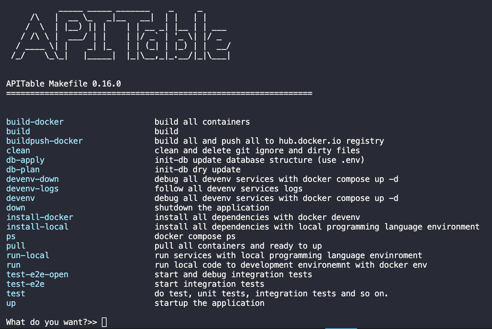

# Geliştirici Kılavuzu

Bu kılavuz APITable'ı geliştirmeye başlamanıza yardımcı olur.

## Bağımlılıklar

Geliştirici ortamınızı kurmadan önce aşağıdaki bağımlılıkların ve programlama dillerinin kurulu olduğundan emin olun:

- `git`
- [docker](https://docs.docker.com/engine/install/)
- [docker-compose v2](https://docs.docker.com/engine/install/)
- `make`


### Programlama Dili

Eğer macOS veya Linux kullanıyorsanız. SDK yöneticisi `sdkman` ve `nvm` ile programlama dilini yüklemenizi öneririz.

```bash
# quick install nvm
curl -o- https://raw.githubusercontent.com/nvm-sh/nvm/v0.39.2/install.sh | bash
# quick install sdkman
curl -s "https://get.sdkman.io" | bash
# install nodejs 
nvm install 16.15.0 && nvm use 16.15.0 && corepack enable
# install java development kit
sdk env install
# install rust toolchain
curl -sSf https://sh.rustup.rs | sh -s -- --default-toolchain nightly --profile minimal -y && source "$HOME/.cargo/env"
```

### macOS

Eksik bağımlılıkları yüklemek için Homebrew kullanmanızı öneririz:

```bash
## necessary required
brew install git
brew install --cask docker
brew install make
brew install pkg-config cairo pango libpng jpeg giflib librsvg pixman
```

### Linux

CentOS / RHEL veya yum ile başka bir Linux dağıtımında

```bash
sudo yum install git
sudo yum install make
```

Ubuntu / Debian veya apt ile diğer Linux dağıtımlarında

```bash
sudo apt update
sudo apt install git
sudo apt install make
```


### Windows

APITable'ı Windows 10/11 üzerinde çalıştırıyorsanız, Windows üzerinde Docker Desktop, WSL üzerinde Ubuntu ve Windows Terminal'i kurmanızı öneririz, Linux için Windows Alt Sistemi (WSL) hakkında daha fazla bilgiyi resmi siteden öğrenebilirsiniz.

Ubuntu'da `apt` kullanarak eksik bağımlılıkları yükleyin:

```bash
sudo apt update
sudo apt install git
sudo apt install make
```


## Hangi Oluşturma Aracını kullanıyoruz?

`gradle` / `npm` / `yarn` gibi diğer derleme araçlarını yönlendiren merkezi derleme aracı girişimiz olarak make kullanıyoruz.

Böylece sadece make komutunu girebilir ve tüm derleme komutlarını görebilirsiniz:

```bash
make
```




## Geliştirme ortamınızı nasıl kurulur?

APITable 3 işlemden oluşmaktadır:

1. backend-server
2. room-server
3. web-server

Geliştirme ortamını yerel olarak başlatmak için aşağıdaki komutları çalıştırın:

```bash
# start databases in dockers
make dataenv 

# install dependencies
make install 

#start backend-server
make run # enter 1  

# and then switch to a new terminal
# start room-server
make run # enter 2

# and then switch to a new terminal
# start  wen-server
make run # enter 3

```


## Ne yapmalıyım?

IDE'niz için Visual Studio Code veya Intellij IDEA kullanmanızı öneririz.

APITable bu iki IDE'nin hata ayıklama yapılandırmalarını hazırladı.

Sadece APITable'ın kök dizinini IDE ile açın.


## SMTP sunucusu nasıl yapılandırılır?

APITable varsayılan olarak SMTP sunucusunu yapılandırmaz, bu da e-posta gönderme özelliği gerektirdiğinden kullanıcıları davet edemeyeceğiniz anlamına gelir.

Kendi kendine e-posta kullanarak `.env` yapılandırmasını değiştirmek ve arka uç sunucusunu yeniden başlatmak gerekir.

```
MAIL_ENABLED=true
MAIL_HOST=smtp.xxx.com
MAIL_PASSWORD=your_email_password
MAIL_PORT=465
MAIL_SSL_ENABLE=true
MAIL_TYPE=smtp
MAIL_USERNAME=your_email
```

Ayrıca, smtp'yi kullanmak için bazı posta kutularının arka planda etkinleştirilmesi gerekir. Ayrıntılar için xxx mailbox smtp öğreticisini arayabilirsiniz.


## macOS M1 liman işçisi çalıştırması altında performans sorunu mu yaşıyorsunuz?

## Geliştirici dökümanları nerededir?

Yerel bir sunucu başlatarak API belgelerine erişebilirsiniz:

1. backend-server için dokümantasyon adresi: http://localhost:8081/api/v1/doc.html

2. room-server için dokümantasyon adresi: http://localhost:3333/nest/v1/docs

Bulut hizmeti API arayüzleriyle ilgileniyorsanız, https://developers.apitable.com/api/introduction adresinden çevrimiçi API belgelerine de doğrudan erişebilirsiniz.

## Panodaki widget miktarının sınırlaması nasıl ayarlanır? (varsayılan olarak 30)

Bu, `.env` dosyasında `DSB_WIDGET_MAX_COUNT` parametresi ayarlanarak elde edilebilir.

## API'nin istek oranı sınırını artırabilir miyim? (varsayılan olarak 5)

`room-server` `.env.default` dosyasında, istek sıklığını ayarlayabilen iki parametre vardır:

1. Birim zaman diliminde yapılabilecek istek sayısını belirtmek için `LIMIT_POINTS` ve `LIMIT_DURATION` ayarlayabilirsiniz. LIMIT_POINTS, tekrar sayısıdır ve LIMIT_DURATION, saniye cinsinden ölçülen süredir.

2. Belirli kullanıcılar için ayrı bir istek sıklığı ayarlamak üzere `LIMIT_WHITE_LIST` parametresini ayarlayabilirsiniz. Değeri bir JSON dizisidir ve yapısı ` Map <string, IBaseRateLimiter>`'ya başvurabilir.

## API çağrısı başına eklenen kayıt sayısı nasıl artırılır? (varsayılan olarak 10)

Bu, `room-server` `.env.default` dosyasında `API_MAX_MODIFY_RECORD_COUNTS` parametresi ayarlanarak elde edilebilir.


## En yeni yayın sürümüne nasıl yükseltilir?


## Varsayılan 80 bağlantı noktası nasıl değiştirilir?
`.env` dosyasındaki yapılandırma özellikleri, env değişkenleri `NGINX_HTTP_PORT` belirtilerek geçersiz kılınabilir

Örneğin. NGINX_HTTP_PORT=8080 olarak ayarlanacaktır